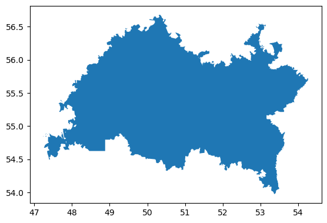

# TRANSLATION OF COORDINATES FROM WGS-84 TO MSK

# Project description
The project is devoted to the development of software for the translation of geographic coordinates from WGS-84 to local coordinate system (MSK) for the regions of the Russian Federation. WGS-84 (World Geodetic System 1984) is a global coordinate system widely used in GPS, while MSK is a coordinate system used in Russia for more accurate mapping and cadastral works.

# Main functions:
1. Coordinate translation: 
    - Develop algorithm and programme logic to translate coordinates from WGS-84 system to MSC.
2. Database operation: 
    - Creation and maintenance of a database containing information on the boundaries and coordinates of the regions of the Russian Federation necessary for correct coordinate translation.
3. Support of different regions: 
    - The programme supports work with all regions of the Russian Federation, allowing you to accurately translate coordinates to MSC for each region.
    
Example of territory drawing:
    

# References:
    - The work itself can be viewed here: https://wgs-msk.soilbox.app/ 
    - Methodology and estimation of recalculation: https://geoinfo.ru/product/gladyshev-aleksandr-konstantinovich/magiya-transformacii-koordinat-ot-mestnogo-k-globalnomu-51340.shtml

# Project structure
src/ - stripped down code of the programme, containing implementation of translation algorithms and interaction with the database.
materials/ - database with coordinates of the Russian Federation regions.