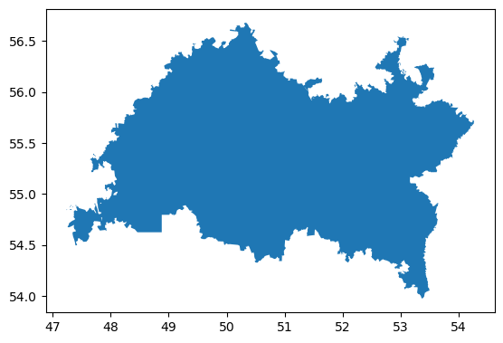

# ПЕРЕВОД КООРДИНАТ ИЗ WGS-84 В МСК

# Описание проекта
Проект посвящён разработке программного обеспечения для перевода географических координат из системы WGS-84 в местную систему координат (МСК) для регионов Российской Федерации. WGS-84 (World Geodetic System 1984) является глобальной системой координат, широко используемой в GPS, тогда как МСК — это система координат, применяемая в России для более точного картографирования и кадастровых работ.

# Основные функции:
1. Перевод координат: 
    - Разработка алгоритма и логики программы для перевода координат из системы WGS-84 в МСК.
2. Работа с базой данных: 
    - Создание и поддержка базы данных, содержащей информацию о границах и координатах регионов Российской Федерации, необходимую для корректного перевода координат.
3. Поддержка различных регионов: 
    - Программа поддерживает работу со всеми регионами РФ, позволяя точно переводить координаты в МСК для каждого региона.
    
Пример прорисовки территории:
    

# Ссылки:
    - Саму работу можно посмотреть здесь: https://wgs-msk.soilbox.app/ 
    - Методика и оценка пересчета: https://geoinfo.ru/product/gladyshev-aleksandr-konstantinovich/magiya-transformacii-koordinat-ot-mestnogo-k-globalnomu-51340.shtml

# Структура проекта
src/ — урезанный код программы, содержащий реализацию алгоритмов перевода и взаимодействие с базой данных.
materials/ — база данных с координатами регионов Российской Федерации.